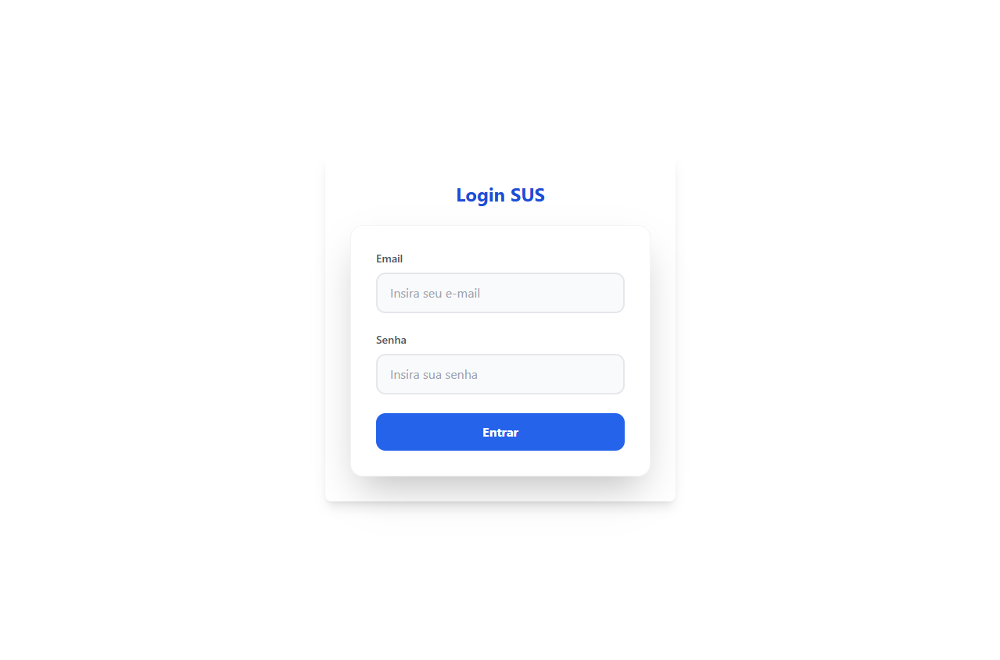

<h1 align='center'>
    
    <p>UPA Digital</p>
</h1>

## 📕 Sobre

**UPA Digital** foi desenvolvido para solucionar o problema de marcação de consultas em unidades básicas de saúde. Fazendo assim, com que os pacientes não precisem mais acordar cedo do dia para enfrentar filas e filas para conseguir marcar uma consulta.

## 🛠️ Recursos Utilizados para desenvolver a aplicação Full Stack

### Front-End

- React;

### Back-End

- Spring Boot

## Banco de dados

- PostgreSQL

## 👨🏾‍💻 Como rodar o projeto na sua máquina

```bash
# Com a sua chave SSH ativada, selecione a pasta onde você quer colocar esse projeto, abra o terminal nela e depois copie e cole o seguinte comando no seu terminal:

$ git clone git@github.com:leofrs/UPA-digital.git
```

Após ter feito o clone, acesse as devidas pastas "Front" e "Back" e rode os projetos de forma individual. Instale as dependências necessárias para rodar o projeto(caso seja necessário).

```bash
# Se você utiliza npm, abra a pasta Front-End no terminal e insira o seguinte comendo em cada terminal
$ npm i
```

obs: Como este projeto foi criado com o vite, execute o comando **npm run dev** para rodar em sua máquina.

## 🧾 Licença

Este Projeto utiliza a lincença MIT.
